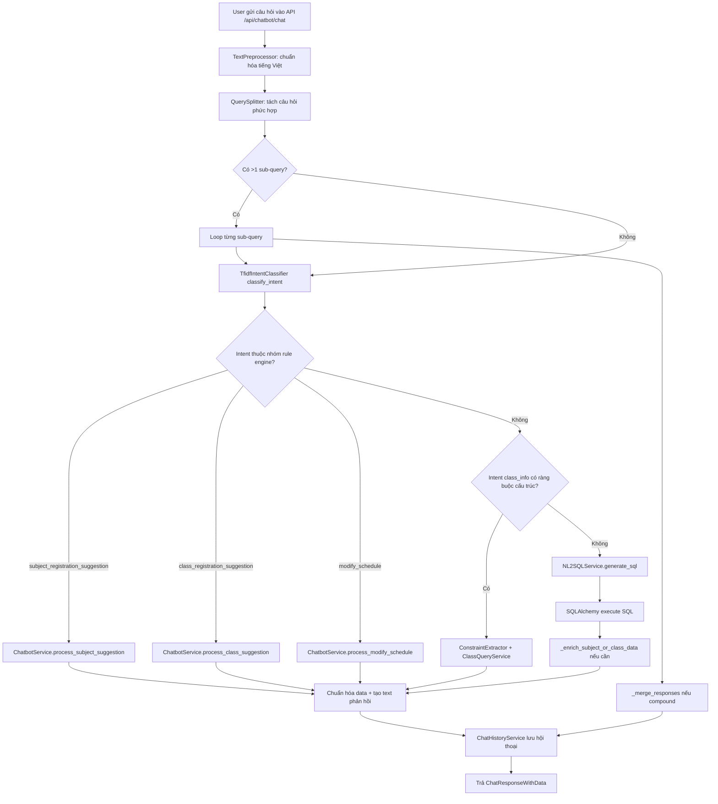
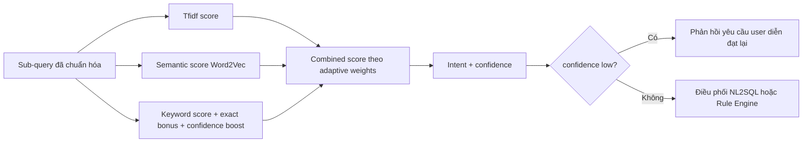
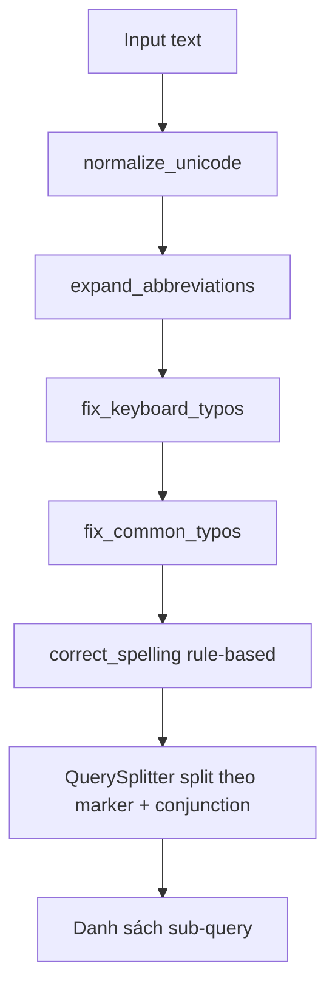
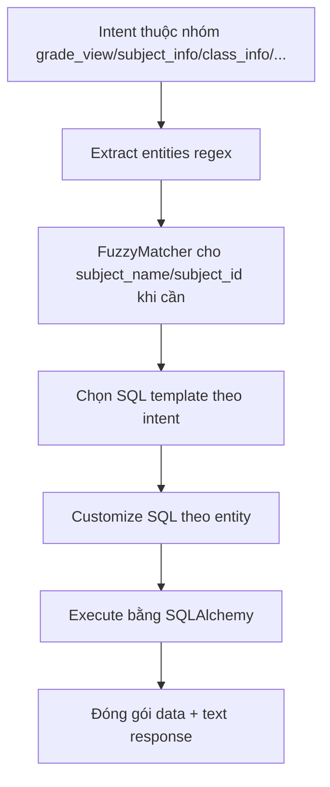
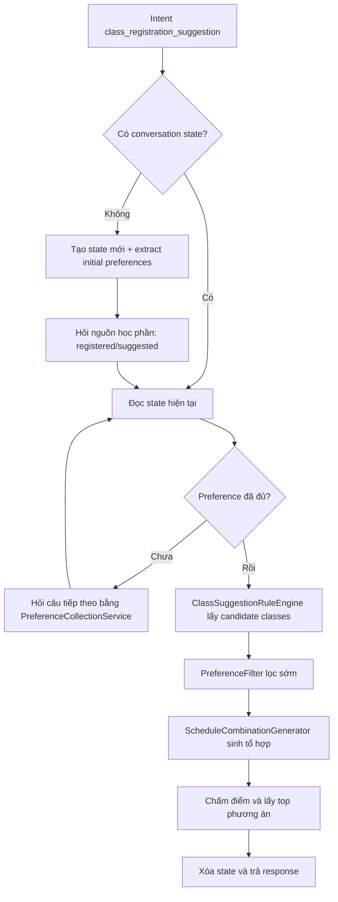
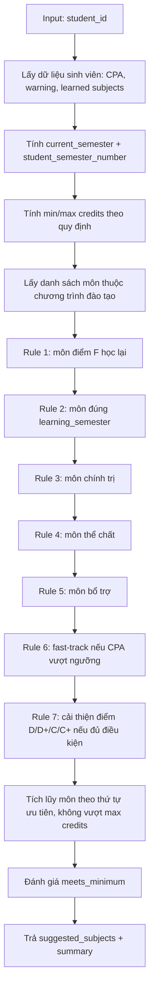
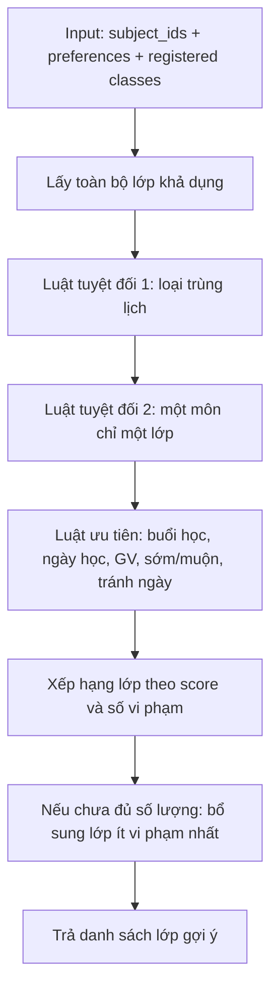

# Chương 3. Công nghệ sử dụng

## 3.1. Mục tiêu chương
Chương này trình bày các công nghệ, nền tảng và cơ chế xử lý đang được sử dụng thực tế trong hệ thống chatbot hỗ trợ sinh viên. Nội dung tập trung vào phần đã triển khai trong mã nguồn, phục vụ trực tiếp các yêu cầu chức năng ở Chương 2, gồm:
- Tra cứu thông tin học tập (điểm, môn học, lớp học, thời khóa biểu).
- Gợi ý đăng ký học phần theo luật học vụ.
- Gợi ý đăng ký lớp theo sở thích và ràng buộc lịch.
- Đối thoại nhiều lượt để thu thập preference trước khi sinh phương án lịch.

Để đảm bảo tính liên kết và nhất quán, các nội dung dưới đây chỉ mô tả đúng luồng đang được gọi trong hệ thống backend hiện tại.

---

## 3.2. Kiến trúc xử lý chatbot hiện tại

### 3.2.1. Sơ đồ tổng quy trình từ input đến response

Diễn giải chi tiết sơ đồ:
1. API nhận câu hỏi từ người dùng tại endpoint chat, đầu vào là chuỗi tự nhiên tiếng Việt và ngữ cảnh người dùng đã xác thực.
2. TextPreprocessor chuẩn hóa câu hỏi để giảm sai lệch do viết tắt, lỗi dấu và lỗi gõ bàn phím.
3. QuerySplitter phân tách câu ghép nhiều ý định thành các sub-query độc lập để tránh trộn logic xử lý.
4. Mỗi sub-query được phân loại intent bằng bộ phân loại TF-IDF + Word2Vec.
5. Tùy intent, hệ thống điều phối vào một trong hai nhóm chính: nhánh tra cứu dữ liệu (NL2SQL hoặc truy vấn có ràng buộc), hoặc nhánh tư vấn theo rule engine.
6. Kết quả từng nhánh được chuẩn hóa về cùng dạng phản hồi, có thể gộp lại nếu câu hỏi ban đầu là compound query.
7. Hệ thống lưu lịch sử hội thoại và trả về phản hồi cuối cùng cho frontend.

Thông số vào và ra của flow tổng:
- Input chính: message (văn bản tự nhiên), user context (student_id sau xác thực), conversation_id (nếu có).
- Output chính: intent, confidence, text phản hồi, data có cấu trúc, metadata phục vụ hiển thị.

Lý do thiết kế flow phân tầng:
- Tách lớp giúp giảm phụ thuộc chéo giữa NLP, luật nghiệp vụ và truy vấn dữ liệu.
- Dễ mở rộng từng khối độc lập (ví dụ thay bộ phân loại intent hoặc thay bộ sinh tổ hợp).
- Giảm rủi ro sai lệch khi câu hỏi chứa nhiều yêu cầu trong cùng một lần nhập.

### 3.2.2. Thành phần chính trong runtime path
- API framework: FastAPI.
- Truy cập dữ liệu: SQLAlchemy ORM + truy vấn SQL text ở nhánh NL2SQL.
- Phân loại intent: TfidfIntentClassifier (TF-IDF + Word2Vec + cosine similarity + keyword scoring).
- Tiền xử lý tiếng Việt: TextPreprocessor.
- Tách câu hỏi ghép: QuerySplitter.
- Trích xuất ràng buộc lớp học: ConstraintExtractor.
- Gợi ý học phần/lớp: SubjectSuggestionRuleEngine, ClassSuggestionRuleEngine.
- Sinh tổ hợp lịch học: ScheduleCombinationGenerator.
- Gợi ý tên môn gần đúng: FuzzyMatcher (rapidfuzz).
- Cache truy vấn/lịch sử hội thoại: Redis (được dùng bởi ChatHistoryService khi khả dụng).

Phân tích thư viện theo vai trò kỹ thuật:
- FastAPI:
	- Cơ chế: định nghĩa route bất đồng bộ, tự động validate schema request/response.
	- Vị trí trong flow: cổng vào/ra của chatbot.
	- Ưu điểm: nhẹ, tốc độ cao, rõ ràng về kiểu dữ liệu.
	- Nhược điểm: logic nghiệp vụ phức tạp cần tổ chức thêm service layer để tránh route phình to.
- SQLAlchemy:
	- Cơ chế: ORM kết hợp thực thi SQL text có kiểm soát ở nhánh NL2SQL.
	- Vị trí trong flow: truy cập CSDL cho cả tra cứu và rule engine.
	- Ưu điểm: linh hoạt giữa ORM và SQL thuần, dễ bảo trì truy vấn.
	- Nhược điểm: cần kiểm soát chặt query động để tránh lỗi logic truy vấn.
- Scikit-learn + Gensim + NumPy:
	- Cơ chế: TF-IDF cho đặc trưng từ khóa, Word2Vec cho ngữ nghĩa, cosine similarity cho độ gần.
	- Vị trí trong flow: intent classification trước khi điều phối nhánh xử lý.
	- Ưu điểm: chạy cục bộ, ổn định, không phụ thuộc API bên ngoài ở luồng chính.
	- Nhược điểm: cần dữ liệu intent có chất lượng, khó bao phủ hoàn toàn các biến thể câu quá mới.
- RapidFuzz:
	- Cơ chế: so khớp gần đúng theo điểm tương đồng chuỗi.
	- Vị trí trong flow: hỗ trợ chuẩn hóa subject_name/subject_id khi người dùng gõ sai.
	- Ưu điểm: nhanh, dễ tích hợp.
	- Nhược điểm: cần ngưỡng phù hợp để cân bằng giữa tự map và yêu cầu người dùng xác nhận lại.
- Redis:
	- Cơ chế: cache key-value có TTL.
	- Vị trí trong flow: tăng tốc đọc danh sách hội thoại/tin nhắn, giảm truy vấn lặp.
	- Ưu điểm: giảm tải DB hiệu quả.
	- Nhược điểm: cần chiến lược invalidate phù hợp để tránh dữ liệu cũ.

---

## 3.3. Sơ đồ suy diễn và các khâu xử lý chi tiết

### 3.3.1. Sơ đồ suy diễn intent và điều phối nhánh

Mô tả cơ chế suy diễn intent:
1. Sub-query đã chuẩn hóa được biểu diễn bởi hai hướng: đặc trưng thống kê (TF-IDF) và đặc trưng ngữ nghĩa (Word2Vec embedding).
2. Hệ thống tính điểm keyword, exact bonus và confidence boost để tăng độ nhạy cho các câu ngắn hoặc câu trùng mẫu mạnh.
3. Điểm tổng hợp được tính theo trọng số thích ứng (adaptive weights) dựa trên độ dài và đặc tính câu hỏi.
4. Kết quả cuối cùng gồm intent và confidence, sau đó định tuyến sang nhánh xử lý tương ứng.

Input và output của Intent Classification:
- Input: một câu hoặc sub-query đã qua tiền xử lý.
- Output:
	- intent dự đoán.
	- confidence mức cao/vừa/thấp.
	- confidence_score và các thành phần điểm nội bộ (TF-IDF, semantic, keyword).

Lý do sử dụng bộ phân loại lai:
- TF-IDF mạnh ở nhận diện tín hiệu từ khóa đặc thù.
- Word2Vec bù đắp khi người dùng diễn đạt ngắn, thay từ đồng nghĩa hoặc không theo mẫu chính xác.
- Cosine similarity cung cấp thước đo đơn giản, ổn định và hiệu quả cho so sánh vector.

Ưu điểm và nhược điểm:
- Ưu điểm:
	- Độ trễ thấp, chạy nội bộ.
	- Dễ phân tích sai số theo từng thành phần điểm.
	- Dễ nâng cấp dữ liệu huấn luyện qua intents.json.
- Nhược điểm:
	- Hiệu năng phụ thuộc chất lượng pattern và từ điển đồng nghĩa.
	- Các câu rất mới hoặc có ngữ cảnh dài phức tạp có thể cần bổ sung dữ liệu mẫu.

### 3.3.2. Khâu 1: Tiền xử lý và tách câu hỏi

Mô tả kỹ thuật khâu tiền xử lý:
- Thư viện/công cụ áp dụng:
	- re, unicodedata, json trong Python.
	- từ điển tùy chỉnh tiếng Việt từ file dữ liệu nội bộ.
- Cơ chế:
	- Chuẩn hóa Unicode.
	- Mở rộng viết tắt.
	- Sửa lỗi gõ phổ biến và lỗi chính tả theo luật.
	- Tách câu phức hợp theo marker intent và liên từ để tạo sub-query.

Input và output:
- Input: chuỗi câu hỏi gốc do người dùng nhập.
- Output:
	- normalized_text dùng cho các khâu NLP sau đó.
	- danh sách sub-query có intent gợi ý ban đầu (nếu tách được).

Vai trò trong flow chung:
- Đây là lớp giảm nhiễu đầu vào, giúp tăng độ chính xác của intent classification và giảm lỗi downstream ở NL2SQL/rule engine.

Lý do áp dụng:
- Dữ liệu câu hỏi thực tế thường có lỗi gõ, viết tắt, thiếu dấu; nếu bỏ qua bước này, độ chính xác của cả hệ thống giảm rõ rệt.

Ưu điểm và nhược điểm:
- Ưu điểm:
	- Cải thiện rõ chất lượng đầu vào trước phân loại.
	- Giảm tình huống một câu nhiều ý bị xử lý sai intent.
- Nhược điểm:
	- Dựa trên luật nên cần cập nhật định kỳ khi xuất hiện kiểu lỗi mới.

### 3.3.3. Khâu 2: Nhánh NL2SQL (tra cứu dữ liệu)

Mô tả kỹ thuật nhánh NL2SQL:
- Thư viện/công cụ áp dụng:
	- re cho entity extraction.
	- SQLAlchemy để thực thi truy vấn.
	- RapidFuzz hỗ trợ sửa/khớp gần đúng tên môn.
- Cơ chế:
	- Nhận intent và câu hỏi đã chuẩn hóa.
	- Trích thực thể như subject_id, subject_name, class_id, day/time.
	- Chọn template SQL theo intent.
	- Điền tham số vào template và thực thi truy vấn.
	- Trả kết quả dạng cấu trúc cho frontend.

Input và output:
- Input: normalized query, intent, student_id.
- Output:
	- sql đã sinh (nếu có).
	- data rows sau truy vấn.
	- text phản hồi, kèm trạng thái lỗi nếu truy vấn thất bại.

Vai trò trong flow chung:
- Đây là nhánh xử lý các yêu cầu tra cứu dữ liệu học vụ, không phải nhánh khuyến nghị.

Lý do áp dụng:
- Nghiệp vụ tra cứu trong phạm vi schema rõ ràng nên cách template + entity extraction vừa đủ chính xác, dễ kiểm soát hơn so với sinh SQL tự do bằng mô hình sinh ngôn ngữ.

Ưu điểm và nhược điểm:
- Ưu điểm:
	- Dễ audit câu SQL sinh ra.
	- Hành vi ổn định với các intent tra cứu đã định nghĩa.
- Nhược điểm:
	- Độ linh hoạt bị giới hạn theo tập template hiện có.
	- Cần cập nhật template khi mở rộng nghiệp vụ mới.

### 3.3.4. Khâu 3: Nhánh gợi ý lớp học tương tác

Mô tả kỹ thuật nhánh gợi ý lớp tương tác:
- Thư viện/công cụ áp dụng:
	- Rule engine nội bộ cho lọc và xếp hạng lớp.
	- itertools.product trong ScheduleCombinationGenerator để tạo tổ hợp.
	- Redis (khi khả dụng) cho cache liên quan hội thoại/lịch sử; trạng thái hội thoại chính đang được quản lý qua ConversationState manager.
- Cơ chế:
	- Thu thập preference qua nhiều lượt hỏi đáp.
	- Sinh danh sách lớp ứng viên theo từng học phần.
	- Lọc sớm theo preference để giảm không gian tổ hợp.
	- Dùng tích Descartes để tạo các combination, kiểm tra xung đột lịch, chấm điểm và chọn top phương án.

Input và output:
- Input:
	- student_id.
	- preference đã thu thập.
	- tập học phần từ rule engine học phần hoặc từ danh sách đã đăng ký.
- Output:
	- danh sách combination đã chấm điểm.
	- phương án khuyến nghị ưu tiên hiển thị đầu tiên.

Lý do sử dụng itertools.product:
- Bài toán yêu cầu chọn một lớp trên mỗi học phần để tạo lịch hoàn chỉnh.
- itertools.product biểu diễn trực tiếp không gian lựa chọn này, dễ đọc và dễ mở rộng khi tăng số học phần.
- Cơ chế sinh iterator giúp tránh tạo toàn bộ tổ hợp cùng lúc, giảm áp lực bộ nhớ.

Ưu điểm và nhược điểm của nhánh này:
- Ưu điểm:
	- Tạo được phương án lịch đầy đủ thay vì chỉ liệt kê lớp rời rạc.
	- Có thể giải thích theo tiêu chí vi phạm/điểm ưu tiên.
	- Kết hợp tốt giữa luật cứng (xung đột lịch) và preference mềm.
- Nhược điểm:
	- Số tổ hợp tăng nhanh theo số lớp ứng viên mỗi môn, cần các bước lọc sớm để giữ thời gian phản hồi.
	- Chất lượng phương án phụ thuộc chất lượng preference thu thập được từ người dùng.

---

## 3.4. Bộ luật đăng ký học phần

### 3.4.1. Sơ đồ tập luật học phần

### 3.4.2. Luật và dữ liệu cấu hình
- Engine: SubjectSuggestionRuleEngine.
- Cấu hình: rules_config.json.
- Các nhóm luật chính:
1. Luật tín chỉ theo kỳ học, mức cảnh báo, trạng thái năm cuối.
2. Ưu tiên môn F phải học lại.
3. Ưu tiên môn theo lộ trình kỳ học.
4. Ưu tiên nhóm môn chính trị chưa hoàn thành.
5. Ưu tiên nhóm thể chất chưa đủ số lượng yêu cầu.
6. Ưu tiên nhóm bổ trợ chưa đủ yêu cầu.
7. Fast-track khi CPA vượt ngưỡng cấu hình.
8. Cải thiện điểm thấp trong điều kiện tổng tín chỉ phù hợp.

---

## 3.5. Bộ luật đăng ký lớp học phần

### 3.5.1. Sơ đồ tập luật lớp học

### 3.5.2. Các nguyên tắc quan trọng
- Engine: ClassSuggestionRuleEngine.
- Cấu hình: class_rules_config.json.
- Luật tuyệt đối:
1. Không trùng lịch theo giao của day, week và time interval.
2. Không gợi ý lớp cho môn đã có trong danh sách đã đăng ký.
- Luật ưu tiên:
1. Buổi học mong muốn và buổi cần tránh.
2. Tránh ngày hoặc ưu tiên ngày học.
3. Tránh học quá sớm hoặc kết thúc quá muộn.
4. Ưu tiên giảng viên theo yêu cầu.
5. Xếp hạng theo điểm sở thích và mức vi phạm.

---

## 3.6. Liên hệ yêu cầu Chương 2, phương án thay thế và lý do lựa chọn

| Vấn đề/yêu cầu ở Chương 2 | Công nghệ/hướng dùng trong hệ thống | Các lựa chọn thay thế | Lý do chọn phương án hiện tại |
|---|---|---|---|
| Hiểu câu hỏi tiếng Việt và phân loại intent nhanh | TfidfIntentClassifier (TF-IDF + Word2Vec + rule tăng cường confidence) | PhoBERT/Sentence-Transformer, Gemini-only classifier, Rasa NLU | Mô hình hiện tại chạy cục bộ, không phụ thuộc API ngoài ở luồng chính, dễ kiểm soát độ trễ và dễ tinh chỉnh bằng intents.json |
| Truy vấn dữ liệu học vụ từ ngôn ngữ tự nhiên | NL2SQLService (template + regex entity + fuzzy resolve) | LLM text-to-SQL end-to-end, semantic parser bằng transformer fine-tune | Cách template/rule-based phù hợp schema cố định, dễ kiểm thử, hạn chế sinh SQL ngoài ý muốn |
| Gợi ý học phần theo quy chế học vụ | SubjectSuggestionRuleEngine + rules_config.json | Mô hình recommendation học máy (collaborative/content-based), tối ưu hóa bằng ILP | Luật học vụ có tính quy định rõ, rule engine minh bạch, dễ giải thích vì sao gợi ý |
| Gợi ý lớp theo preference cá nhân và tránh xung đột | ClassSuggestionRuleEngine + PreferenceFilter + ScheduleCombinationGenerator | CSP/OR-Tools, GA/heuristic optimizer khác | Thiết kế hiện tại bám sát ràng buộc nghiệp vụ, diễn giải được và tích hợp trực tiếp với hội thoại nhiều lượt |
| Đối thoại nhiều lượt để thu thập preference | ConversationState + PreferenceCollectionService | FSM framework ngoài, workflow engine | Cấu trúc hiện tại nhẹ, kiểm soát tốt các stage choose_subject_source/collecting/completed |
| Tăng khả năng hiểu tên môn user gõ sai | FuzzyMatcher (rapidfuzz) | Levenshtein tự cài, Elasticsearch fuzzy query | rapidfuzz nhanh, đơn giản, phù hợp dữ liệu tên môn/lớp hiện có |
| Giảm tải truy vấn lặp và cache lịch sử hội thoại | RedisCache (khi khả dụng) | In-memory cache, Memcached | Redis phù hợp TTL, key-value và có thể mở rộng đa tiến trình |

---

## 3.7. Thành phần có code nhưng chưa đi trong luồng chatbot chính

Qua đối chiếu route chính chatbot hiện tại, một số thành phần tồn tại trong mã nguồn nhưng chưa được gọi trực tiếp ở runtime path của endpoint chat:
- HybridIntentClassifier, PhoBERTIntentClassifier, IntentClassifier (Gemini) không được route chính khởi tạo để phân loại intent; route đang dùng TfidfIntentClassifier.
- RasaIntentClassifier và rasa_example mang tính thử nghiệm/so sánh, không nằm trong luồng API chat hiện tại.
- MessageQueueService và RabbitMQ worker có triển khai, nhưng chưa được nối vào chatbot_routes để xử lý message bất đồng bộ trong luồng chính.
- ViT5 trong NL2SQLService chỉ load khi truyền model_path; khởi tạo mặc định ở route không truyền model_path nên chạy rule-based fallback.

Phần này được nêu rõ để đảm bảo báo cáo phản ánh đúng hệ thống đang chạy thực tế.

---

## 3.8. Tổng kết chương
Hệ thống chatbot hiện tại sử dụng kiến trúc lai giữa rule-based và mô hình vector truyền thống cho hai mục tiêu: (1) tính giải thích và bám quy chế học vụ, (2) vẫn đảm bảo linh hoạt khi tiếp nhận ngôn ngữ tự nhiên tiếng Việt. Điểm cốt lõi là phân tách rõ ba nhánh xử lý: nhánh tra cứu dữ liệu NL2SQL, nhánh gợi ý học phần theo tập luật, và nhánh gợi ý lớp học tương tác có sinh tổ hợp lịch.

Thiết kế này đáp ứng trực tiếp các yêu cầu nghiệp vụ ở Chương 2, đồng thời giữ được khả năng mở rộng trong tương lai (thay engine phân loại intent, nâng cấp optimizer, hoặc kích hoạt lại các thành phần LLM/queue khi cần).

---

## Tài liệu tham khảo

### Mã nguồn và tài liệu nội bộ dự án
1. backend/app/routes/chatbot_routes.py
2. backend/app/services/chatbot_service.py
3. backend/app/services/nl2sql_service.py
4. backend/app/chatbot/tfidf_classifier.py
5. backend/app/services/text_preprocessor.py
6. backend/app/services/query_splitter.py
7. backend/app/services/constraint_extractor.py
8. backend/app/services/class_query_service.py
9. backend/app/services/schedule_combination_service.py
10. backend/app/rules/subject_suggestion_rules.py
11. backend/app/rules/class_suggestion_rules.py
12. backend/app/rules/rules_config.json
13. backend/app/rules/class_rules_config.json
14. backend/app/services/fuzzy_matcher.py
15. backend/app/cache/redis_cache.py
16. backend/app/services/conversation_state.py
17. backend/app/services/chat_history_service.py
18. backend/docs/Rule.md
19. backend/docs/CHATBOT_TECHNICAL_DOCUMENTATION_V2.md
20. backend/docs/INTERACTIVE_CLASS_SUGGESTION_DESIGN.md

### Tài liệu kỹ thuật bên ngoài
1. FastAPI Documentation: https://fastapi.tiangolo.com/
2. SQLAlchemy Documentation: https://docs.sqlalchemy.org/
3. scikit-learn Documentation: https://scikit-learn.org/stable/
4. Gensim Word2Vec Documentation: https://radimrehurek.com/gensim/
5. RapidFuzz Documentation: https://rapidfuzz.github.io/RapidFuzz/
6. Redis Documentation: https://redis.io/docs/
